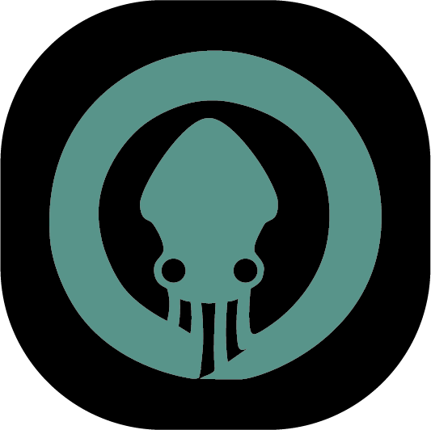

  

**Mini-Glo** is a project developed by Juan Carlos Lara and Erick Salas using Gitkraken's Glo Boards api to create an Amazon Alexa skill, a Chrome Browser extensiona and a custom api hosted at https://ermiry.com/api/mini-glo to glue the projects together.

## Development Status

### Alexa Skill

  You can now use the Alexa skill to create boards, columns, cards, edit and delete them and almost everything you may expect from the Glo Boards GUI.
  
  You can read the documentation on our skill in docs/Mini Glo.pdf to get a better gasp on how it was made and how it works. But also you can ask Alexa for help inside the skill and she will tell you what you can do and how to do it.

  To run the Alexa skill you first need to tell the next command: "alexa mini glo".
  Once you are inside the alexa skill, you can ask alexa for help with: "alexa mini glo help"

  You can also see for youself a little demonstration on how our skill wokrs here: https://www.youtube.com/watch?v=D2ghWLkUIL4&feature=youtu.be

### Chrome Browser Extension

  The Mini Glo Chrome extension is being developed using React and works by using our own api to forward the requests to the Glo api, this is for it to be directly connect to our Alexa skill and we can provide a more delightful user experience.

  As of 31/03/2019 the extension is still under development and is not finished yet. There are some working fuinctionalities, but we hope we can continue its development in the upcomming months.
